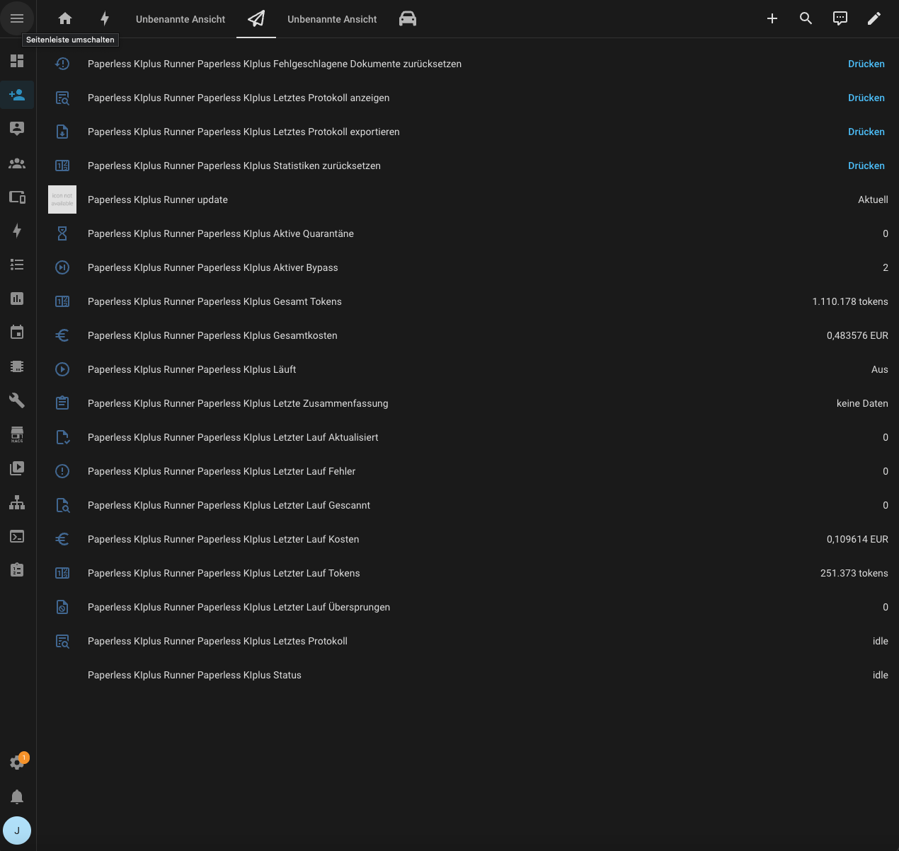
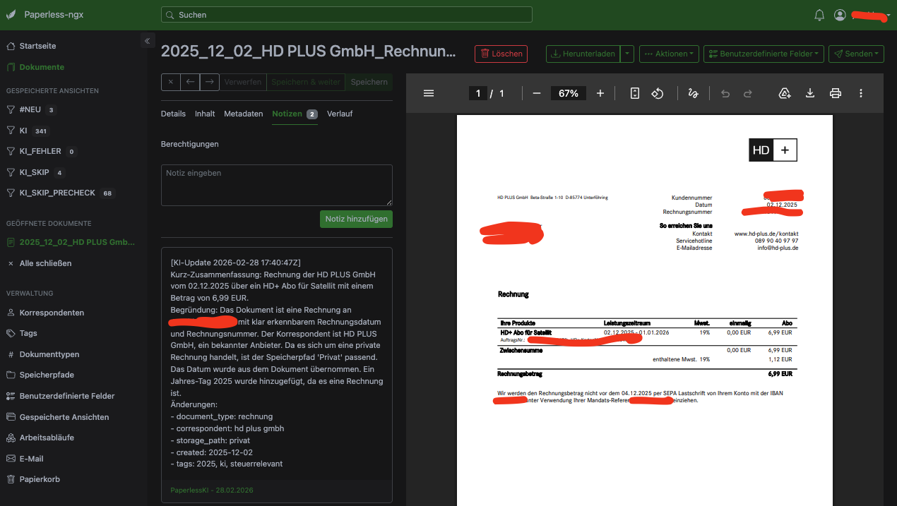
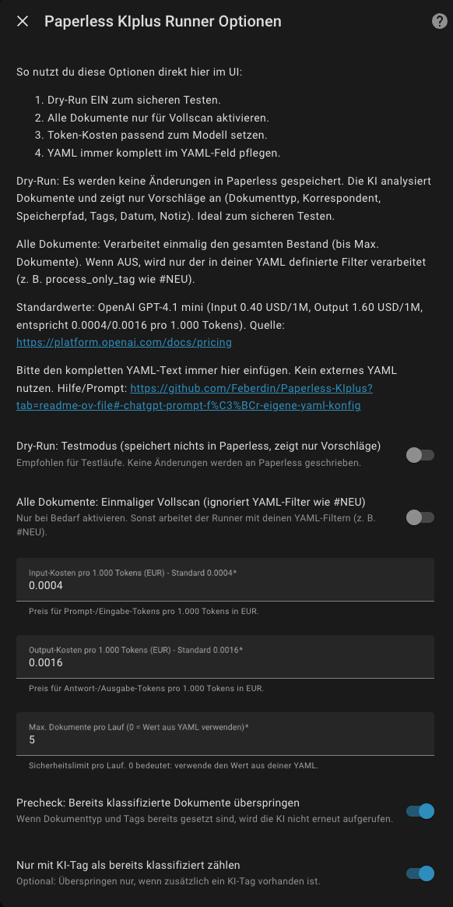
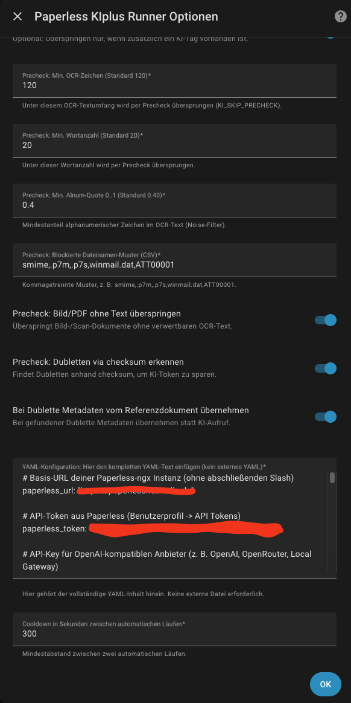

# Paperless KIplus Home Assistant Integration

Die Integration verbindet Home Assistant mit deinem Paperless-ngx-Workflow und klassifiziert Dokumente per KI automatisiert.

## Was macht die Integration?

Die Integration startet den KI-Sorter direkt aus Home Assistant, schreibt Ergebnisse zurück nach Paperless-ngx und stellt Laufstatus, Kosten und Logs als Entitäten/Buttons bereit.

### Bilder

#### Geräteansicht in Home Assistant


#### Dokument mit KI-Notiz in Paperless-ngx


#### Optionen in Home Assistant (Teil 1)


#### Optionen in Home Assistant (Teil 2)


## Wie installiere ich die Integration?

1. HACS öffnen -> `Integrationen` -> `Custom repositories`.
2. Repository hinzufügen:
   - URL: `https://github.com/Feberdin/Paperless-KIplus`
   - Kategorie: `Integration`
3. `Paperless KIplus Runner` installieren.
4. Home Assistant neu starten.
5. Unter `Einstellungen -> Geräte & Dienste` die Integration hinzufügen.
6. In den Optionen deine YAML-Konfiguration vollständig im YAML-Feld pflegen.
   Alternative mit ChatGPT:
   - Nutze den folgenden Prompt, um dir eine vollständige YAML erstellen zu lassen.
   - Ergebnis 1:1 in das YAML-Feld der Integration kopieren.

```text
Erstelle mir eine vollständige YAML-Konfiguration für die Home-Assistant Integration
"Paperless KIplus Runner" (Paperless-ngx KI-Sorter).

Ziel:
- Dokumente in Paperless-ngx per KI klassifizieren (Dokumenttyp, Korrespondent,
  Speicherpfad, Tags, Datum, Notiz).
- Sicherer Betrieb in Home Assistant mit Fokus auf stabile Automationen.

Wichtige Anforderungen:
1) Gib nur gültiges YAML aus (ohne Markdown, ohne Erklärtext).
2) Nutze sinnvolle Default-Werte für einen produktiven Start.
3) Setze process_only_tag auf "#NEU".
4) Setze dry_run auf false.
5) Nutze Skip-/Precheck-Optionen so, dass bereits klassifizierte Dokumente
   zuverlässig übersprungen werden.
6) Setze reprocess_ki_tagged_documents auf false.
7) Aktiviere Quarantäne- und Duplicate-Prechecks.
8) Aktiviere parallele KI-Verarbeitung nur moderat (z. B. 3 bis 5 Jobs).
9) Lass Platzhalter für:
   - paperless_url
   - paperless_token
   - ai_api_key
   - ai_model
10) Gib alle relevanten Felder vollständig aus, damit die YAML direkt in Home
    Assistant eingefügt werden kann.

Rahmendaten:
- Paperless URL: <PAPERLESS_URL>
- Paperless Token: <PAPERLESS_TOKEN>
- AI API Key: <AI_API_KEY>
- AI Modell: <AI_MODEL>
- AI Base URL (optional): <AI_BASE_URL>

Erzeuge jetzt die vollständige YAML.
```

## Welche Features hat die Integration?

- Native Home-Assistant Integration mit Config Flow und Options-UI
- KI-gestützte Dokumentklassifizierung für:
  - Dokumenttyp
  - Korrespondent
  - Speicherpfad
  - Tags
  - Dokumentdatum
- Optionales Auto-Anlegen fehlender Entitäten (Korrespondent, Dokumenttyp, Tags)
- Dry-Run Modus ohne Schreibzugriffe in Paperless
- Vollscan-Modus (`Alle Dokumente`) für Bestandsläufe
- Precheck-/Skip-Logik zur Token-Einsparung
- Doppelte Dokumente per Checksum erkennen (optional Metadatenübernahme)
- Fehler-Quarantäne und Tag-Bypass für robuste Dauerläufe
- KI-Notizen inkl. Begründung/Kurz-Zusammenfassung
- Token-/Kosten-Tracking (letzter Lauf + Gesamtwerte)
- Service `paperless_kiplus.run` mit Overrides (`force`, `wait`, `dry_run`, `all_documents`, `max_documents`)
- Geräte-Buttons für:
  - Letztes Protokoll anzeigen
  - Letztes Protokoll exportieren
  - Statistiken zurücksetzen
  - Fehlgeschlagene Dokumente zurücksetzen
- Parallele KI-Verarbeitung (konfigurierbar)
- KI-Tag-Vorfilter: KI-getaggte Dokumente können standardmäßig komplett ausgeschlossen werden

## Versionsverlauf (antichronologisch)

- `v1.0.0` (2026-03-08)
  - Erstes stabiles Release für HACS.

- `v0.1.49` (2026-03-08)
  - KI-Tag-Vorfilter vor der Abarbeitung ergänzt.
  - Performance-Metriken im Log ergänzt (KI-Batches/Zeiten).

- `v0.1.48` (2026-03-06)
  - `max_documents` zählt übersprungene Dokumente nicht mehr als Verarbeitungsbudget.

- `v0.1.47` (2026-03-06)
  - Option `reprocess_ki_tagged_documents` eingeführt (Default AUS).

- `v0.1.46` (2026-03-03)
  - `already_classified_skip` im All-Documents-Verhalten nachgeschärft.

- `v0.1.45` (2026-03-03)
  - Tag-Sanitizer, KI-Retry-Backoff und robustere PATCH-Fallbacks.

- `v0.1.44` (2026-03-03)
  - Parallele KI-Verarbeitung mit konfigurierbarer Worker-Anzahl.

- Ältere Releases
  - Weitere Tags vorhanden: `v0.1.43` bis `v0.1.2`.
